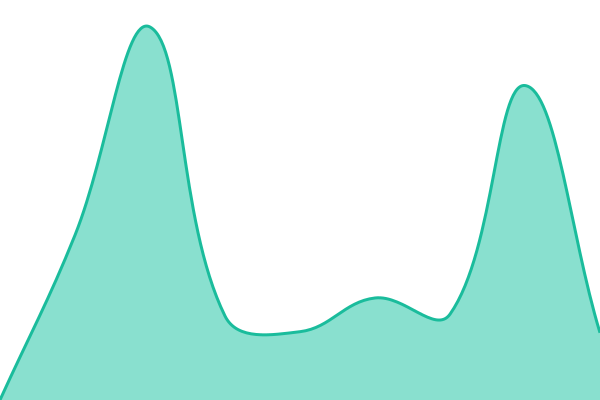
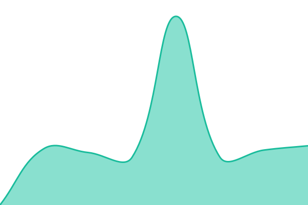
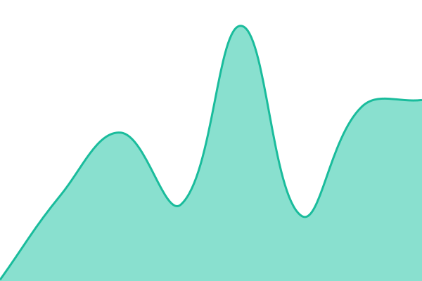
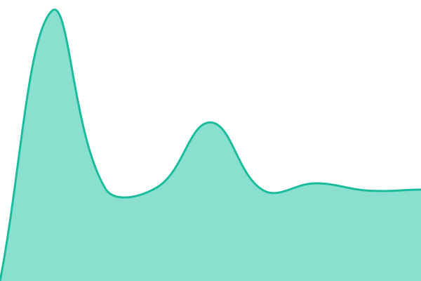
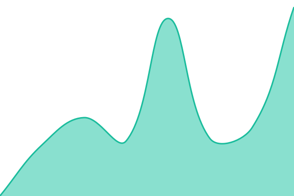
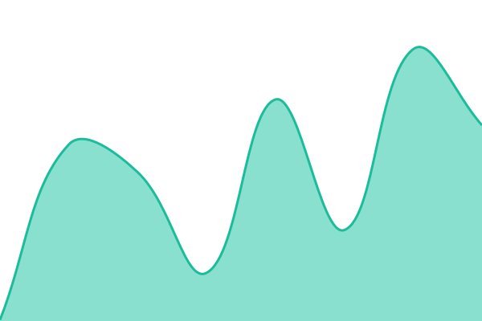
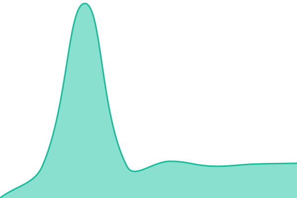
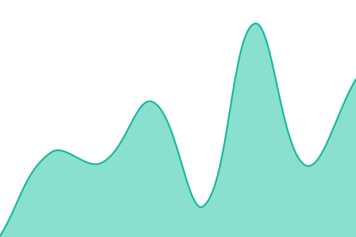
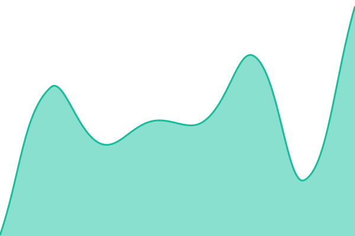

# [📈 Live Status](https://bertie-create.github.io/website-monitor-v3): <!--live status--> **🟧 Partial outage**

This repository contains the open-source uptime monitor and status page for [bertie-create](https://bertie-create.github.io/website-monitor-v3), powered by [Upptime](https://github.com/upptime/upptime).

With [Upptime](https://upptime.js.org), you can get your own unlimited and free uptime monitor and status page, powered entirely by a GitHub repository. We use [Issues](https://github.com/bertie-create/website-monitor-v3/issues) as incident reports, [Actions](https://github.com/bertie-create/website-monitor-v3/actions) as uptime monitors, and [Pages](https://bertie-create.github.io/website-monitor-v3) for the status page.

<!--start: status pages-->
<!-- This summary is generated by Upptime (https://github.com/upptime/upptime) -->
<!-- Do not edit this manually, your changes will be overwritten -->
<!-- prettier-ignore -->
| URL | Status | History | Response Time | Uptime |
| --- | ------ | ------- | ------------- | ------ |
|  [Advisory](https://advisory.co.za/) | 🟩 Up | [advisory.yml](https://github.com/bertie-create/website-monitor-v3/commits/HEAD/history/advisory.yml) | 

 933ms
     
 | 

<a href="https://bertie-create.github.io/website-monitor-v3/history/advisory">100.00%</a>
    

|  [Biorevolution](https://www.biorevolution.co.za/) | 🟩 Up | [biorevolution.yml](https://github.com/bertie-create/website-monitor-v3/commits/HEAD/history/biorevolution.yml) | 

 566ms
     
 | 

<a href="https://bertie-create.github.io/website-monitor-v3/history/biorevolution">100.00%</a>
    

|  [Crop Biolife](https://cropbiolife.co.za/) | 🟩 Up | [crop-biolife.yml](https://github.com/bertie-create/website-monitor-v3/commits/HEAD/history/crop-biolife.yml) | 

 2924ms
     
 | 

<a href="https://bertie-create.github.io/website-monitor-v3/history/crop-biolife">99.60%</a>
    

|  [Bump to Babe](https://bumptobabe.co.za/) | 🟩 Up | [bump-to-babe.yml](https://github.com/bertie-create/website-monitor-v3/commits/HEAD/history/bump-to-babe.yml) | 

 4895ms
     
 | 

<a href="https://bertie-create.github.io/website-monitor-v3/history/bump-to-babe">100.00%</a>
    

|  [Chabo AI](https://chabo.ai/) | 🟩 Up | [chabo-ai.yml](https://github.com/bertie-create/website-monitor-v3/commits/HEAD/history/chabo-ai.yml) | 

 5681ms
     
 | 

<a href="https://bertie-create.github.io/website-monitor-v3/history/chabo-ai">100.00%</a>
    

|  [Finance Fusion](https://financefusion.com/) | 🟩 Up | [finance-fusion.yml](https://github.com/bertie-create/website-monitor-v3/commits/HEAD/history/finance-fusion.yml) | 

 1033ms
     
 | 

<a href="https://bertie-create.github.io/website-monitor-v3/history/finance-fusion">100.00%</a>
    

|  [Just Cruizin Namibia](https://justcruizinnamibia.com/) | 🟩 Up | [just-cruizin-namibia.yml](https://github.com/bertie-create/website-monitor-v3/commits/HEAD/history/just-cruizin-namibia.yml) | 

 152ms
     
 | 

<a href="https://bertie-create.github.io/website-monitor-v3/history/just-cruizin-namibia">100.00%</a>
    

|  [Lekker Digital](https://lekkerdigital.com.na/) | 🟩 Up | [lekker-digital.yml](https://github.com/bertie-create/website-monitor-v3/commits/HEAD/history/lekker-digital.yml) | 

 1363ms
     
 | 

<a href="https://bertie-create.github.io/website-monitor-v3/history/lekker-digital">100.00%</a>
    

|  [Linkup Youth](https://linkupyouth.co.za/) | 🟥 Down | [linkup-youth.yml](https://github.com/bertie-create/website-monitor-v3/commits/HEAD/history/linkup-youth.yml) | 

 1478ms
     
 | 

<a href="https://bertie-create.github.io/website-monitor-v3/history/linkup-youth">5.70%</a>
    

|  [Moi Magnets](https://moimagnets.co.za/) | 🟩 Up | [moi-magnets.yml](https://github.com/bertie-create/website-monitor-v3/commits/HEAD/history/moi-magnets.yml) | 

 2318ms
     
 | 

<a href="https://bertie-create.github.io/website-monitor-v3/history/moi-magnets">99.46%</a>
    

|  [Nifty Studio](https://niftystudio.co.za/) | 🟩 Up | [nifty-studio.yml](https://github.com/bertie-create/website-monitor-v3/commits/HEAD/history/nifty-studio.yml) | 

 507ms
     
 | 

<a href="https://bertie-create.github.io/website-monitor-v3/history/nifty-studio">100.00%</a>
    

|  [Paarl Physios](https://paarlphysios.com/) | 🟩 Up | [paarl-physios.yml](https://github.com/bertie-create/website-monitor-v3/commits/HEAD/history/paarl-physios.yml) | 

 5446ms
     
 | 

<a href="https://bertie-create.github.io/website-monitor-v3/history/paarl-physios">98.57%</a>
    

|  [Wellington Physios](https://wellingtonphysios.co.za/) | 🟩 Up | [wellington-physios.yml](https://github.com/bertie-create/website-monitor-v3/commits/HEAD/history/wellington-physios.yml) | 

 4692ms
     
 | 

<a href="https://bertie-create.github.io/website-monitor-v3/history/wellington-physios">100.00%</a>
    

|  [Kuilsriver Physios](https://kuilsriverphysios.co.za/) | 🟩 Up | [kuilsriver-physios.yml](https://github.com/bertie-create/website-monitor-v3/commits/HEAD/history/kuilsriver-physios.yml) | 

 4520ms
     
 | 

<a href="https://bertie-create.github.io/website-monitor-v3/history/kuilsriver-physios">100.00%</a>
    

|  [Qubesure](https://qubesure.co.za/) | 🟩 Up | [qubesure.yml](https://github.com/bertie-create/website-monitor-v3/commits/HEAD/history/qubesure.yml) | 

 4891ms
     
 | 

<a href="https://bertie-create.github.io/website-monitor-v3/history/qubesure">100.00%</a>
    

|  [Re-Solve](https://www.re-solve.co.za/) | 🟩 Up | [re-solve.yml](https://github.com/bertie-create/website-monitor-v3/commits/HEAD/history/re-solve.yml) | 

 2139ms
     
 | 

<a href="https://bertie-create.github.io/website-monitor-v3/history/re-solve">97.71%</a>
    

|  [Seizmic AI](https://seizmic.ai/) | 🟩 Up | [seizmic-ai.yml](https://github.com/bertie-create/website-monitor-v3/commits/HEAD/history/seizmic-ai.yml) | 

 119ms
     
 | 

<a href="https://bertie-create.github.io/website-monitor-v3/history/seizmic-ai">100.00%</a>
    

|  [Siyafunda EF](https://www.siyafundaef.org.za/) | 🟩 Up | [siyafunda-ef.yml](https://github.com/bertie-create/website-monitor-v3/commits/HEAD/history/siyafunda-ef.yml) | 

 665ms
     
 | 

<a href="https://bertie-create.github.io/website-monitor-v3/history/siyafunda-ef">100.00%</a>
    

|  [Solar Project](https://solarproject.co.za/) | 🟩 Up | [solar-project.yml](https://github.com/bertie-create/website-monitor-v3/commits/HEAD/history/solar-project.yml) | 

 921ms
     
 | 

<a href="https://bertie-create.github.io/website-monitor-v3/history/solar-project">100.00%</a>
    

|  [Symbyte](https://symbyte.tech/) | 🟩 Up | [symbyte.yml](https://github.com/bertie-create/website-monitor-v3/commits/HEAD/history/symbyte.yml) | 

 5053ms
     
 | 

<a href="https://bertie-create.github.io/website-monitor-v3/history/symbyte">99.72%</a>
    

|  [True North Group](https://truenorthgroup.ai/) | 🟩 Up | [true-north-group.yml](https://github.com/bertie-create/website-monitor-v3/commits/HEAD/history/true-north-group.yml) | 

 129ms
     
 | 

<a href="https://bertie-create.github.io/website-monitor-v3/history/true-north-group">100.00%</a>
    

|  [Three Sixty](https://threesixty.me/) | 🟩 Up | [three-sixty.yml](https://github.com/bertie-create/website-monitor-v3/commits/HEAD/history/three-sixty.yml) | 

 2181ms
     
 | 

<a href="https://bertie-create.github.io/website-monitor-v3/history/three-sixty">37.27%</a>
    

|  [Cloudways App 1360454](https://wordpress-1360454-5686975.cloudwaysapps.com/) | 🟥 Down | [cloudways-app-1360454.yml](https://github.com/bertie-create/website-monitor-v3/commits/HEAD/history/cloudways-app-1360454.yml) | 

 0ms
     
 | 

<a href="https://bertie-create.github.io/website-monitor-v3/history/cloudways-app-1360454">0.00%</a>
    

|  [Tusk T-Shirts Namibia](https://tusktshirtsnamibia.com/) | 🟥 Down | [tusk-t-shirts-namibia.yml](https://github.com/bertie-create/website-monitor-v3/commits/HEAD/history/tusk-t-shirts-namibia.yml) | 

 2094ms
     
 | 

<a href="https://bertie-create.github.io/website-monitor-v3/history/tusk-t-shirts-namibia">99.39%</a>
    

|  [VHT Law](https://vhtlaw.co.za/) | 🟩 Up | [vht-law.yml](https://github.com/bertie-create/website-monitor-v3/commits/HEAD/history/vht-law.yml) | 

 1073ms
     
 | 

<a href="https://bertie-create.github.io/website-monitor-v3/history/vht-law">100.00%</a>
    

|  [Velden Botanicals](https://veldenbotanicals.com/) | 🟩 Up | [velden-botanicals.yml](https://github.com/bertie-create/website-monitor-v3/commits/HEAD/history/velden-botanicals.yml) | 

 121ms
     
 | 

<a href="https://bertie-create.github.io/website-monitor-v3/history/velden-botanicals">100.00%</a>
    

|  [Exo Golf ZA](https://za.exo-golf.com/) | 🟩 Up | [exo-golf-za.yml](https://github.com/bertie-create/website-monitor-v3/commits/HEAD/history/exo-golf-za.yml) | 

 540ms
     
 | 

<a href="https://bertie-create.github.io/website-monitor-v3/history/exo-golf-za">100.00%</a>
    

|  [Tadi Bush Lodge](https://tadibushlodge.co.za/) | 🟩 Up | [tadi-bush-lodge.yml](https://github.com/bertie-create/website-monitor-v3/commits/HEAD/history/tadi-bush-lodge.yml) | 

 4882ms
     
 | 

<a href="https://bertie-create.github.io/website-monitor-v3/history/tadi-bush-lodge">99.14%</a>
    

|  [Atrax Logistics](https://atraxlogistics.co.za/) | 🟩 Up | [atrax-logistics.yml](https://github.com/bertie-create/website-monitor-v3/commits/HEAD/history/atrax-logistics.yml) | 

 3034ms
     
 | 

<a href="https://bertie-create.github.io/website-monitor-v3/history/atrax-logistics">100.00%</a>
    

|  [Trainyard](https://www.trainyard.co.za/) | 🟥 Down | [trainyard.yml](https://github.com/bertie-create/website-monitor-v3/commits/HEAD/history/trainyard.yml) | 

 964ms
     
 | 

<a href="https://bertie-create.github.io/website-monitor-v3/history/trainyard">0.00%</a>
    

|  [Trainyard Models](https://trainyardmodels.com/) | 🟥 Down | [trainyard-models.yml](https://github.com/bertie-create/website-monitor-v3/commits/HEAD/history/trainyard-models.yml) | 

 1962ms
     
 | 

<a href="https://bertie-create.github.io/website-monitor-v3/history/trainyard-models">0.00%</a>
    

|  [Prosum AI](https://prosum.ai/) | 🟩 Up | [prosum-ai.yml](https://github.com/bertie-create/website-monitor-v3/commits/HEAD/history/prosum-ai.yml) | 

 136ms
     
 | 

<a href="https://bertie-create.github.io/website-monitor-v3/history/prosum-ai">100.00%</a>
    

|  [Element 5](https://element-5.com/) | 🟩 Up | [element-5.yml](https://github.com/bertie-create/website-monitor-v3/commits/HEAD/history/element-5.yml) | 

 90ms
     
 | 

<a href="https://bertie-create.github.io/website-monitor-v3/history/element-5">100.00%</a>
    

<!--end: status pages-->

[**Visit our status website →**](https://bertie-create.github.io/website-monitor-v3)

## 📄 License

- Powered by: [Upptime](https://github.com/upptime/upptime)
- Code: [MIT](./LICENSE) © [Anand Chowdhary](https://anandchowdhary.com)
- Data in the `./history` directory: [Open Database License](https://opendatacommons.org/licenses/odbl/1-0/)
